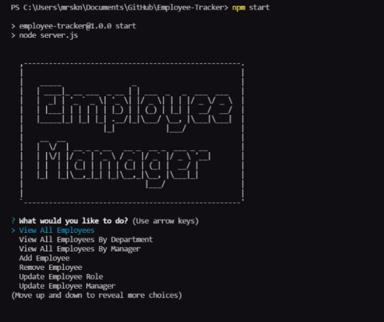

# Employee-Tracker
Command-line Application to view and manage the departments, roles, and employees of a company in order to organize and plan a business.

# Installation

Clone the repositry from GitHub and open using Visual Studio Code.

# Usage 
[Demo Video](https://drive.google.com/file/d/1B6xuPmxGCqrWSxBNaq3OBw_qA3c-1uDU/view?usp=sharing)

# Credits

Made by [Shannon Dukes]

[inquirer.js](https://www.npmjs.com/package/inquirer)

[Node MySQL 2](https://www.npmjs.com/package/mysql2)

[console.table](https://www.npmjs.com/package/console.table)

[Jest](https://jestjs.io/)

# Questions

[Contact Me](mrs.knit.wit.dukes@gmail.com)

[GitHub](https://github.com/ShannonDukes)